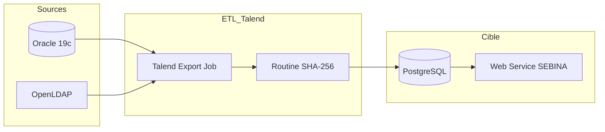

# Projet SEBINA - Synchronisation des référentiels lecteurs (UHA)

Ce dépôt documente les flux ETL (Talend) permettant l'alimentation des tables pivots pour le projet **SEBINA**. Ces traitements assurent la consolidation des données personnels et étudiants vers un Web Service chargé de l'alimentation d'une base lecteurs.

## 1. Architecture du flux

Le système repose sur une extraction depuis les bases de gestion (Oracle), un enrichissement par l'annuaire LDAP et une détection de changements par empreinte numérique (Hash).

## 2. Logique technique : "Incremental Merge" et "Full Refresh"

Le traitement maintient un état de référence par un mécanisme de double lecture sur la cible.

### 2.1 Détection différentielle (SHA-256)

- **Calcul** : Une empreinte SHA-256 est générée par la routine Java `SHA256.hash256` par concaténation brute des champs sources.
- **Comparaison** : Le job effectue un rapprochement entre le flux source et la table cible existante sur le couple `{Identifiant, Hash}`.
- **Filtrage** : Seules les lignes dont le hash est absent de la cible (nouveautés ou modifications) sont isolées pour la mise à jour.

> Pour le détail du mécanisme de hash, voir [docs/hash-differentiel.md](docs/hash-differentiel.md).

### 2.2 Reconstruction de la table

La table cible est reconstruite à chaque exécution pour garantir l'exhaustivité des données transmises au Web Service :

1. **Fusion** : Les nouvelles lignes sont agrégées à l'historique lu en début de job via un composant `tUnite`.
2. **Tri** : Un tri descendant sur la date de mise à jour (`UPDATE_DATE`) permet de prioriser la donnée la plus récente.
3. **Déduplication** : Le composant `tUniqRow` garantit l'unicité de l'identifiant pivot après fusion.
4. **Persistance** : La table cible est vidée (`Truncate/Clear`) puis ré-alimentée par insertion massive (`Insert`).

---

## 3. Référentiel des flux

| Flux | Source Oracle | Schéma | Identifiant Pivot | Fiche détaillée |
| --- | --- | --- | --- | --- |
| **Export_PERS** | COCKTAIL | `GRHUM` | `supannEmpId` | [docs/Export_PERS.md](docs/Export_PERS.md) |
| **Export_ETU** | APOGEE | `PASSCAMPUS` | `ETU_NUMBER` | [docs/Export_ETU.md](docs/Export_ETU.md) |

---

## 4. Stack Technique

- **ETL** : Talend Open Studio for Data Integration v7.3.1.
- **Langage** : Java 8 (Routine `SHA256` personnalisée).
- **Bases de données** : Oracle 19c (Source), PostgreSQL (Cible).
