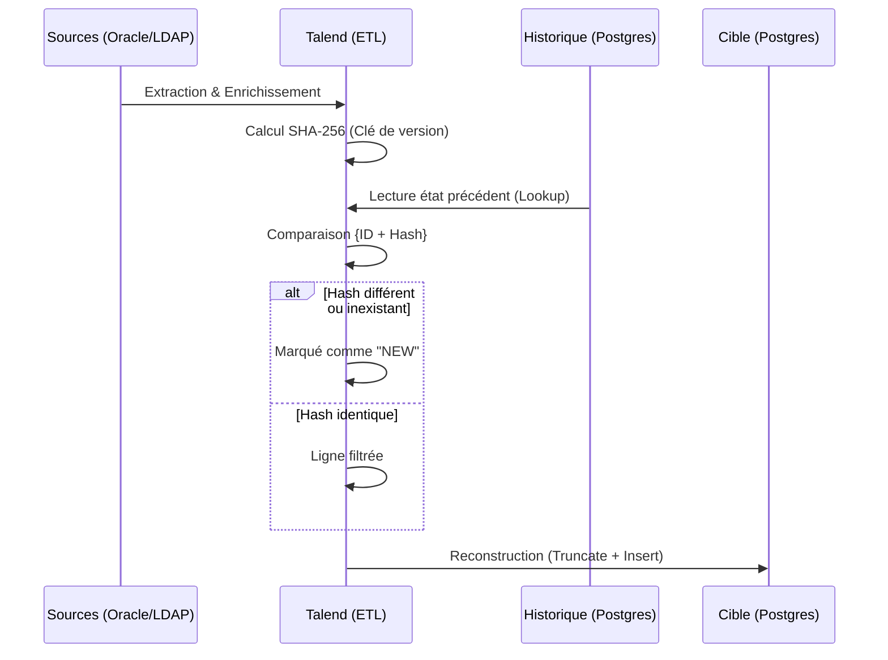
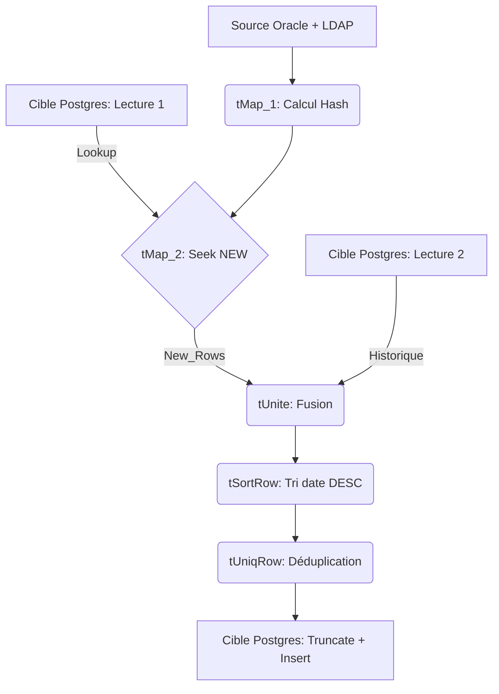

# Architecture : Détection différentielle par Hash SHA-256

## 1. Problématique

Comment synchroniser un référentiel source (Oracle/LDAP) vers une cible (PostgreSQL) en identifiant uniquement les évolutions, sans comparaison colonne par colonne et sans dépendre de triggers ou logs de modification côté source ?

## 2. Principe : le Versioning par Empreinte

Un **hash SHA-256** est calculé sur l'intégralité des champs d'un enregistrement. Cette empreinte de 64 caractères hexadécimaux devient l'unique point de comparaison : si le couple `{Identifiant, Hash}` est absent de la cible, la ligne est considérée comme nouvelle ou modifiée.

---

## 3. Construction du Hash

### Étape 1 — Normalisation

Chaque champ est nettoyé via `talendTrim` pour supprimer les espaces parasites et éviter les faux positifs.

### Étape 2 — Concaténation

Les champs sont concaténés pour former une chaîne unique.

> **⚠️ Note** : La concaténation est réalisée sans séparateur. En théorie, cela peut produire des collisions (ex : champ A = `"abc"`, B = `"def"` donne le même résultat que A = `"ab"`, B = `"cdef"`). En pratique, avec des champs de types et longueurs hétérogènes (39 champs pour le flux Personnels), le risque est négligeable.

### Étape 3 — Hachage

La routine Java `SHA256.hash256` génère l'empreinte.

**Exemple (Flux Personnels)** : le hash couvre 39 champs incluant `LASTNAME`, `BIRTHDATE`, `MAIL`, `PHONE_WORK` (LDAP) et le CSN de la carte.

---

## 4. Le Pattern "Double Lecture & Merge"

Le détail du flux de reconstruction (fusion, tri, déduplication, truncate/insert) est décrit dans le [README principal](../README.md#22-reconstruction-de-la-table). Le diagramme ci-dessous en donne une vue orientée composants Talend :

---

## 5. Avantages et Limites

### Avantages

- **Performance** : la comparaison porte sur une seule colonne indexée plutôt que sur N colonnes métier.
- **Indépendance** : ne repose sur aucun mécanisme côté source (triggers, CDC, logs).
- **Déterminisme** : à données identiques, hash identique — le traitement est idempotent.

### Limites

- **Maintenance** : tout ajout ou suppression de champ dans une vue source (ex : `V_UHA_WSSIGB_PERS_EXPORT`) impose de mettre à jour l'expression du hash dans le `tMap`.
- **Sensibilité technique** : un changement de casse ou d'espaces déclenche une mise à jour même si la donnée métier est inchangée (atténué par l'étape de normalisation).
- **Suppressions non natives** : le flux détecte les évolutions mais pas les disparitions. La règle des **30 jours de grâce**, calculée dans la vue Oracle via le champ `DELETION_DATE`, pallie cette limite.
